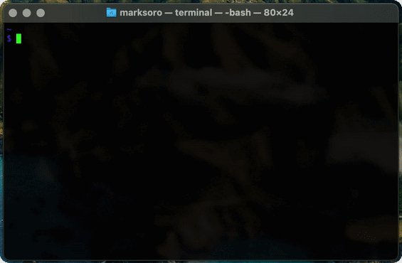
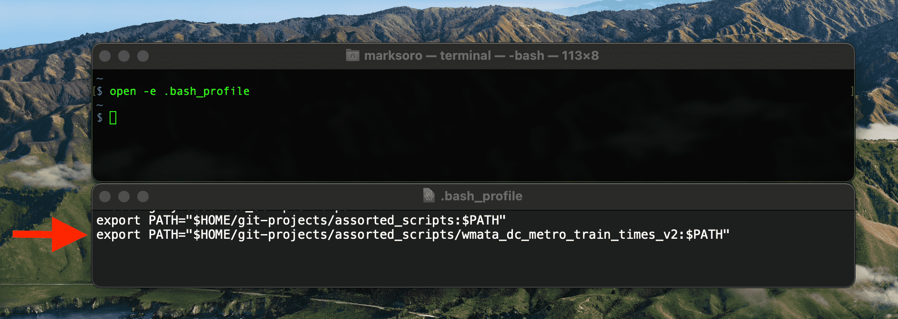

# WMATA D.C. Metro train arrival times

A python executable that returns Washington Metropolitan Area Transit Authority(WMATA) train arrival times.

### Run python scripts like any terminal commands.

1. To make your script executable, add the script's path to your .bash_profile.

  1.1. `open -e .bash_profile` this opens your .bash_profile in your      TextEdit app.

  1.2. Add the path at the end of .bash_profile. *Here's mine*:
  

  1.3. Restart your terminal.

2. Change file type to an executable:

    2.1 Add this at the top of script:
    `#!/usr/bin/env python`

    2.2. Change the script to an executable:
    `chmod +x [your python script]`
